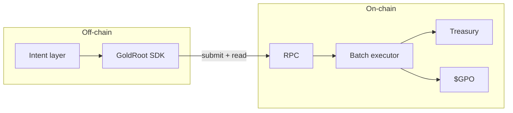

<p align="center">
  
</p>

# GoldRoot Protocol — $GPO

**Intent-based dust aggregation layer on Solana.** Batch-settle fragmented positions into $GPO with MEV-aware routing, single-transaction CPI, and sub-400ms settlement. Built for wallets, aggregators, and institutional order flow.

---

## Overview

GoldRoot Protocol (GPO) is a **intent-centric** layer that aggregates long-tail token dust across Solana and settles into the protocol reserve asset $GPO. The system uses **batch settlement** and **cross-program invocation (CPI)** so that many small positions are merged in a single transaction, reducing per-unit cost and front-running surface. Routing is **Jupiter-compatible** (amount, slippage, path) and designed for integration with existing aggregator stacks. The TypeScript SDK exposes a minimal, typed API for submitting intents and reading protocol state—no custom RPC or off-chain indexer required.

- **Intent-based flow** — Users sign intents; execution is batched and settled on-chain with deterministic ordering.
- **MEV-aware routing** — Slippage and route params are enforced at settlement; no retroactive reordering.
- **Single-tx CPI** — Dust → swap → treasury → $GPO mint in one transaction, minimizing latency and fee bleed.
- **SDK-first** — `@goldroot/sdk`: `recycleDust`, `getStats`, typed IDs; runs in Node and browser.

---

## Architecture



| Layer | Role |
|-------|------|
| **Intent** | User/wallet signs recycle intent (amount, slippage, deadline). |
| **SDK** | Builds and submits tx, reads program state; no custom infra. |
| **Batch executor** | On-chain: aggregates intents, runs swap path, settles to treasury, mints $GPO. |
| **Treasury / $GPO** | Reserve accounting and protocol token. |

---

## Features

- **Intent-based recycling** — Submit dust-recycle intents; execution is batched and settled in one shot.
- **MEV-resistant semantics** — Slippage and route fixed at intent; settlement is first-come-first-serve within batch.
- **Single-transaction CPI** — No multi-tx flows; dust → swap → treasury → $GPO in one atomic tx.
- **TypeScript SDK** — `GoldRootSDK(connection, programId)`, `recycleDust(user, amount)`, `getStats()`; full TypeScript types, Node + browser.
- **Jupiter-compatible params** — Same mental model as aggregator routes (amount, slippage bps, optional path hints).
- **No oracle dependency** — Execution path and pricing from on-chain AMM/DEX state; no external oracle.

---

## Tech stack

- **Core Protocol:** Rust, Anchor Framework 0.29+, Sealevel Runtime (SVM).
- **Infrastructure:** Jito-Solana (MEV bundle protection), Helius/Triton (Geyser RPC streaming).
- **Indexing & Data:** Custom gRPC indexer, PostgreSQL (timeseries), Redis (hot caching).
- **Client & SDK:** TypeScript, `@solana/web3.js`, Jupiter Aggregator API integration.
- **Security & Ops:** Squads Protocol (Multisig governance), Soteria (static analysis).

---

## Getting started

**Prerequisites:** Node 18+, npm or yarn.

```bash
git clone https://github.com/gpodotgold/GPO.git
cd GPO/sdk
npm ci
npm run build
npm test
```

**Usage:**

```typescript
import { GoldRootSDK } from '@goldroot/sdk';
import { Connection, PublicKey } from '@solana/web3.js';

const connection = new Connection('https://api.mainnet-beta.solana.com');
const sdk = new GoldRootSDK(connection, programId);

const tx = await sdk.recycleDust(userPubkey, amountLamports);
const stats = await sdk.getStats();
```

---

## Security

Protocol and treasury logic are designed for audit; report vulnerabilities responsibly.

---

## License

MIT.
